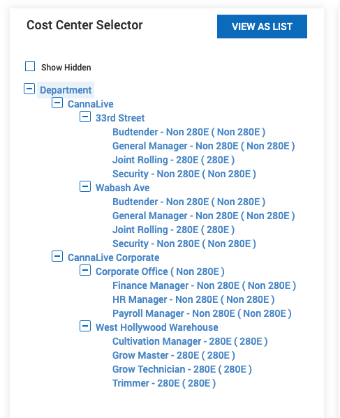

# Cost Centers 

Cost centers in Wurk are represented as a tree. This tree can have any number 
of layers and any number of parent child releationships.  

You can find cost centers by loggin in as an admin and navigating to 
*Company Settings > Global Setup > Cost Centers*  

Then edit a cost center to view its tree:   
  

## APIs

#### List All
Retrieve a list of call centers by using the following API call: 
```bash
curl --request GET \
  --url 'https://secure.saashr.com/ta/rest/v2/companies/%7CCalebTest/config/cost-centers?tree_index=0' \
  --header 'authentication: Bearer {bearer token} \
```
As documented here: https://secure.saashr.com/ta/docs/rest/public/#

This call returns the entire tree, relationships are represented by the `parent_id`. 
Within this structure every entity, including locations, in your business model is just another cost center. 

#### Create New Cost Centers 

New cost centers can be created with the Batch API documented here: https://secure.saashr.com/ta/docs/rest/public/#
This API will not overwrite existing cost centers

#### Cost Center Jobs

Create new cost center jobs using the API documented here: https://secure.saashr.com/ta/docs/rest/public/#
